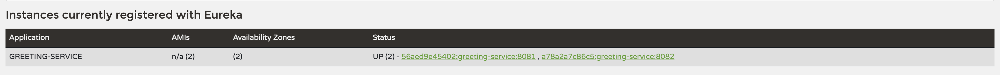
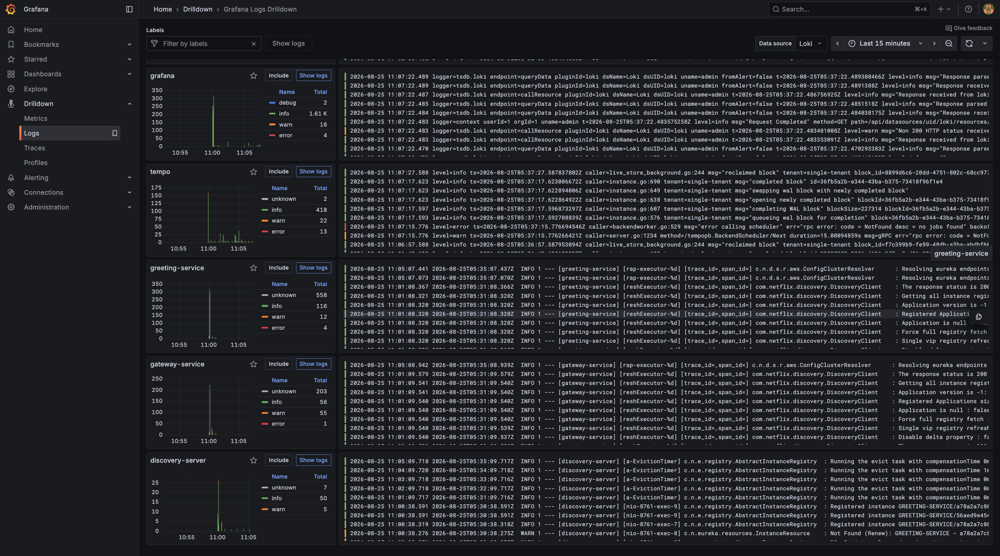
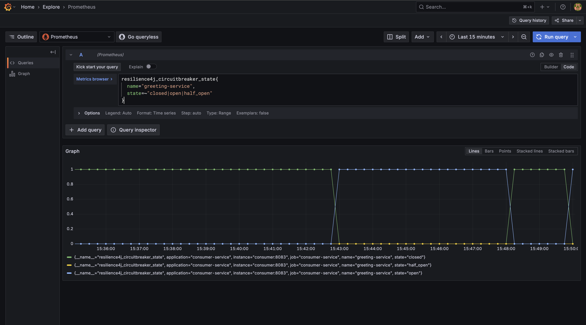

# Spring Cloud Microservices Reference

A hands-on Spring Cloud reference architecture demonstrating **service discovery, API gateway routing, client-side load balancing, resilient service-to-service communication, integration testing, containerized development, metrics, distributed tracing, centralized logging, and trace-to-log correlation**.

> **Goal:** provide a small but production-oriented microservices playground where distributed-system patterns can be built, tested, observed, and demonstrated locally.

## Architecture

```text
External Client
      │
      ▼
Gateway :8080
      │
      ▼
Consumer :8083
      │
      ├── Retry
      ├── Circuit Breaker
      └── Load Balancer
              │
        ┌─────┴─────┐
        ▼           ▼
Greeting :8081  Greeting :8082
        ▲           ▲
        └─────┬─────┘
              │
        Eureka :8761

Observability: Prometheus → Grafana ← Tempo / Loki
                         ↑
                       Alloy
```

Eureka is used for service registration and discovery; it is not itself part of the synchronous request path.

## Modules

| Module | Port | Responsibility |
|---|---:|---|
| `discovery-service` | 8761 | Eureka service registry |
| `gateway-service` | 8080 | External API entry point and routing |
| `greeting-service` | 8081 / 8082 | Discoverable service with multiple instances |
| `consumer-service` | 8083 | Service-to-service client with resilience policies |
| Prometheus | 9090 | Metrics collection |
| Grafana | 3000 | Metrics, traces, and logs visualization |
| Tempo | 3200 / 4317 / 4318 | Distributed trace storage and OTLP ingestion |
| Loki | 3100 | Centralized log storage |
| Alloy | 12345 | Docker log collection and forwarding to Loki |

## Key capabilities

- **Service discovery** with Netflix Eureka
- **API Gateway** with Spring Cloud Gateway
- **Client-side load balancing** with Spring Cloud LoadBalancer
- **Multiple service instances** for the same logical service
- **Retry** for transient downstream failures
- **Circuit breaker** with Resilience4j
- **Fallback** when the downstream service is unavailable
- **Micrometer / Prometheus metrics**
- **OpenTelemetry distributed tracing** exported to Tempo
- **Centralized Docker log collection** with Grafana Alloy and Loki
- **Trace IDs in application logs** for cross-signal correlation
- **Trace → logs and logs → trace navigation** in Grafana
- **Load-balancing, resilience, and Gateway integration tests**
- **Docker Compose** for reproducible local execution
- **GitHub Actions CI** for Maven verification and Docker image builds

## Technology Stack

| Area | Technology |
|---|---|
| Language | Java 17 |
| Framework | Spring Boot 3.x |
| Cloud | Spring Cloud |
| Discovery | Netflix Eureka |
| Gateway | Spring Cloud Gateway |
| Load balancing | Spring Cloud LoadBalancer |
| Resilience | Resilience4j |
| Metrics | Micrometer + Prometheus |
| Tracing | Micrometer Tracing + OpenTelemetry |
| Trace backend | Grafana Tempo |
| Logging | Logback + Grafana Alloy + Loki |
| Visualization | Grafana |
| Build | Maven |
| Testing | JUnit 5, Spring Boot Test, MockWebServer |
| Runtime | Docker / Docker Compose |
| CI | GitHub Actions |

## Quick Start

### Prerequisites

- Java 17
- Maven 3.9+
- Docker Desktop / Docker Engine with Compose

### Build and test

```bash
mvn clean verify
```

### Start the complete environment

```bash
docker compose up --build -d
docker compose ps
```

### Verify the services

```bash
curl http://localhost:8081/
curl http://localhost:8082/
curl http://localhost:8080/service
curl http://localhost:8083/
```

## Observability

### Metrics

Application services expose Prometheus-compatible metrics through Spring Boot Actuator:

```text
http://localhost:8080/actuator/prometheus
http://localhost:8083/actuator/prometheus
http://localhost:8081/actuator/prometheus
http://localhost:8082/actuator/prometheus
```

### Traces

```text
HTTP request
    ↓
gateway-service
    ↓
consumer-service / greeting-service
    ↓
Micrometer Tracing
    ↓
OpenTelemetry OTLP
    ↓
Tempo
    ↓
Grafana Explore
```

Generate traces:

```bash
for i in {1..20}; do
  curl -s http://localhost:8080/service
  echo
done
```

### Logs

```text
Docker containers
       ↓
Grafana Alloy
       ↓
Loki :3100
       ↓
Grafana
```

The Loki stream selector uses `service_name` as a low-cardinality service label; trace IDs remain in log content rather than becoming Loki stream labels.

## Load Balancing Demonstration

```bash
for i in {1..10}; do
  curl -s http://localhost:8080/service
  echo
done
```

Both registered `greeting-service` instances can receive traffic. The sequence does not need to alternate perfectly.

## Resilience Demonstration

The consumer service uses Resilience4j Retry and Circuit Breaker around the downstream greeting-service call.

```text
downstream failure
       ↓
     Retry
       ↓
Circuit Breaker
       ↓
    Fallback
```

With both greeting instances stopped:

```bash
docker compose stop greeting-service-1 greeting-service-2
curl http://localhost:8083/
```

Expected fallback:

```text
Service temporarily unavailable
```

Restart them with:

```bash
docker compose start greeting-service-1 greeting-service-2
```

## Automated Tests

`LoadBalancingIntegrationTest` verifies calls can reach two independently running test service instances.

`ResilienceIntegrationTest` verifies retry, circuit opening, fallback, and subsequent short-circuiting while the circuit is open.

`GatewayIntegrationTest` runs the actual Gateway on a random port and uses an isolated `MockWebServer` as the discovered `greeting-service`. It verifies:

1. `/service` is routed through `lb://greeting-service`;
2. `StripPrefix=1` forwards to the downstream `/` endpoint while preserving the query string;
3. downstream `503` responses are propagated.

The Gateway test disables Eureka and uses Spring Cloud's `SimpleDiscoveryClient`, so it does not require Docker or a running Eureka server.

## Architecture Decision Records

The repository documents the architectural reasoning behind the main design choices in [`docs/adr`](docs/adr/README.md).

| ADR | Decision |
|---|---|
| 001 | Eureka for service discovery |
| 002 | Gateway as the external entry point |
| 003 | Resilience4j for fault tolerance |
| 004 | Tempo for distributed tracing |
| 005 | Loki for centralized logging |
| 006 | Isolated integration tests without infrastructure dependencies |
| 007 | Keep trace IDs out of Loki stream labels |

The ADRs capture context, alternatives, consequences, and validation rather than presenting technology choices as universally correct.

## CI/CD

GitHub Actions runs Maven verification on pushes and pull requests targeting `master`, followed by Docker image validation and Compose configuration validation.

## Observability Demo

The screenshots below are captured from the running local environment and show the main operational signals and failure behavior.

### 1. Eureka — Service Discovery

Two `greeting-service` instances are registered with Eureka and available for client-side load balancing.



### 2. Loki — Centralized Service Logs

Application and infrastructure logs are collected centrally through Grafana Alloy and queried through Loki.



### 3. Tempo — Distributed Trace

A request can be followed across service boundaries, showing the gateway and downstream service spans in a single trace.


### 4. Resilience4j — Circuit Breaker State Transitions

The circuit breaker automatically transitions between `CLOSED`, `OPEN`, and `HALF_OPEN` as downstream failures and recovery probes occur.




## Engineering Patterns Demonstrated

- Service discovery decoupling consumers from instance locations
- Gateway routing as a single external entry point
- Client-side load balancing across service instances
- Bounded retries for transient failures
- Circuit breakers for controlled degradation
- Fallback behavior for unavailable dependencies
- Gateway integration testing with isolated downstream dependencies
- Integration testing without requiring a full Docker environment
- Metrics collection and visualization
- Distributed tracing across service boundaries
- Centralized logging with low-cardinality Loki labels
- Trace ID propagation into application logs
- Trace-to-log and log-to-trace correlation
- Reproducible local infrastructure with Docker Compose
- CI quality gates for builds, tests, and container images

## Roadmap

- [x] Java 17 / Spring Boot 3 modernization
- [x] Eureka service discovery
- [x] Multiple service instances
- [x] Client-side load balancing
- [x] Spring Cloud Gateway
- [x] Resilience4j retry and circuit breaker
- [x] Integration and resilience tests
- [x] Gateway integration tests
- [x] Docker Compose environment
- [x] GitHub Actions CI
- [x] Prometheus metrics
- [x] Grafana metrics visualization
- [x] OpenTelemetry distributed tracing
- [x] Grafana Tempo trace backend
- [x] Loki centralized logging
- [x] Grafana Alloy Docker log collection
- [x] Trace-to-log correlation
- [x] Architecture decision records
- [ ] Kubernetes deployment examples

## Useful Commands

```bash
mvn clean verify
docker compose up --build -d
docker compose down
docker compose logs -f gateway-service
docker compose logs -f consumer-service
docker compose logs -f tempo
docker compose logs -f loki
docker compose logs -f alloy
docker compose ps
```

## Author

**Syed Jafar** — Software Development Engineer

- GitHub: https://github.com/syedjafar01

